<!--
  description: Awesome Proteomics Informatics is a curated list of the best proteomics software tools for mass spectrometry (MS) data analysis — DDA and DIA search engines, peptide and protein identification, label-free and isobaric quantification (MaxQuant, Skyline, OpenMS, FragPipe, DIA-NN, Spectronaut, PEAKS), PTM analysis, de novo sequencing, spectral libraries, and more.
  keywords: proteomics, proteomics informatics, mass spectrometry, MS data analysis, DDA, DIA, SWATH, peptide identification, protein quantification, MaxQuant, Skyline, OpenMS, FragPipe, MSFragger, DIA-NN, Spectronaut, PEAKS Studio, Scaffold, Byonic, de novo sequencing, PTM analysis, spectral libraries, open-source proteomics software
  author: ishandutta2007
  lang: en
-->

# 🧬 Awesome-Proteomics-Informatics

> **The definitive curated list of proteomics informatics software** — open-source and commercial tools for mass spectrometry data analysis. 🌟

  

<!-- Badge list (left → right) -->

## 📚 Table of Contents

- [🚀 Top Proteomics Informatics Platforms](#-top-proteomics-informatics-platforms)
- [☁️ SaaS / Hosted Platforms](#️-saas--hosted-platforms)
- [💻 Open-Source Softwares](#-open-source-softwares)
  - [⚙️ Core Frameworks & Search / Quantification Engines](#️-core-frameworks--search--quantification-engines)
  - [🧩 Specialized Libraries & Related Tools](#-specialized-libraries--related-tools)
  - [📦 Additional Notable Open-Source Tools](#-additional-notable-open-source-tools)
- [🎯 Quick Start Recommendations](#-quick-start-recommendations)
- [🤝 Contributing](#-contributing)
- [⭐ Star History](#-star-history)

---

## 🚀 Top Proteomics Informatics Platforms

A curated list of leading software tools for proteomics informatics — covering peptide/protein identification, quantification (DDA, DIA, labeled, label-free), PTM analysis, spectral library search, de novo sequencing, and targeted/untargeted workflows from mass spectrometry data.  
**🎯 Primary focus: open-source software.**

Commercial / hosted platforms are listed separately for completeness. Open-source alternatives and community tools are emphasized throughout.

This list is a practical starting point for researchers, bioinformaticians, and core facilities evaluating proteomics analysis platforms for LC-MS/MS workflows.

---

## ☁️ SaaS / Hosted Platforms

| Platform | 🏢 Company size (revenue / budget) | 💰 Pricing (starting tier) | 🆓 Free tier / Trial | Description | Key Focus |
|----------|-------------------------------|-------------------------|-------------------|-------------|-----------|
| **[Byonic](https://www.proteinmetrics.com/)** (Protein Metrics) | **€78.9B** — ultimate parent Siemens (FY2025); Protein Metrics acquired by Dotmatics/Insightful Science (Dec 2021) | **$5,225/year** academic · **$10,450/year** commercial (per user) | 30-day free trial (with Byos evaluation); **Byonic Viewer** free download | Highly sensitive full MS/MS search engine for peptide and protein identification. Strong for glycoproteomics, phosphoproteomics, wide modification searches, and high-throughput workflows. Vendor-neutral. | Sensitive search engine (especially PTMs/glycans) |
| **[Proteome Discoverer](https://www.thermofisher.com/)** (Thermo Fisher) | **$42.88B revenue** (FY2024) | ~$3,705 per base module/node (list price); full client-server packages scale higher; custom quote | 30-day free trial of commercial nodes; core/open-source nodes remain free | Comprehensive, extensible platform for protein identification, quantification (LFQ, isobaric tags), PTM analysis, DIA/DDA, glycoproteomics, cross-linking, and top-down. Integrates multiple search engines (Sequest HT, Mascot, etc.) and advanced rescoring (INFERYS, CHIMERYS). | Full-featured commercial proteomics suite (especially Thermo instruments) |
| **[ProteinPilot](https://sciex.com/)** (SCIEX) | **$23.9B revenue** (FY2024, parent Danaher) | Custom quote (perpetual or subscription; e.g., 8-core vs 32-core node options) | Free trial available via SCIEX portal on request | Protein identification and relative quantification software featuring the Paragon algorithm for extensive PTM and variant searching, plus Pro Group for protein inference. Optimized for SCIEX instruments. | Peptide/protein ID with broad PTM coverage |
| **[Skyline](https://skyline.ms/)** | **$7.8B budget** (Univ. of Washington) | **Free** (open source, Apache 2.0) | Free forever — no limits | Freely available Windows application for targeted quantitative proteomics (SRM/MRM, PRM, DIA/SWATH, MS1 filtering). Excellent method development, visualization, and multi-vendor support. | Targeted & quantitative method development |
| **[Spectronaut](https://biognosys.com/)** (Biognosys) | **$3.37B** (majority owner Bruker, 2024); Biognosys private | Custom quote; commercial seat licenses typically ~$5,000–$10,000/year | 30-day free trial (full version + support); **Spectronaut Viewer** free forever | Gold-standard vendor-independent DIA analysis software. Supports library-based and library-free (directDIA) workflows, AI-augmented models, high-throughput quantification, and deep proteome coverage. | DIA proteomics analysis & quantification |
| **[MaxQuant](https://www.maxquant.org/)** | **€2.1B budget** (Max Planck Society) | **Free** for academic & non-profit use (license required otherwise) | Free forever for academic/non-profit — full feature set, no limits | Widely used integrated suite for high-resolution quantitative proteomics. Includes Andromeda search engine, MaxLFQ, SILAC/TMT/iTRAQ support, and MaxDIA. Developed by the Cox lab (Max Planck). | Discovery proteomics quantification (DDA + DIA) |
| **[MS-DIAL](https://prime.psc.riken.jp/compms/msdial/main.html)** | **¥100B budget** (~$0.7B, RIKEN) | **Free** (open source) | Free forever — no limits | Open-source software originally for metabolomics/lipidomics DIA deconvolution; also used in broader MS data mining including multimodal and lipidome analysis. Supports multiple vendors and advanced structural elucidation. | DIA deconvolution & untargeted MS analysis |
| **[Omics Discovery Index (OmicsDI)](https://www.omicsdi.org/)** | **€385M budget** (EMBL-EBI) | **Free** | Free forever — no limits | Public data discovery portal/index that aggregates proteomics (and other omics) datasets from multiple repositories for search and discovery. | Omics data discovery & indexing |
| **[PEAKS Studio](https://www.bioinfor.com/)** (Bioinformatics Solutions) | Private (bootstrapped; no public revenue) | Custom quote (workstation / floating-node packages) | 15-day free trial (complete version incl. DeepNovo); **PEAKS Studio Viewer** free forever | Complete bottom-up proteomics solution with powerful *de novo* sequencing (DeepNovo), database search, PTM/SPIDER homology, DDA & DIA support, sequence variant analysis, and quantification. Vendor-neutral. | *De novo* + database search & DIA/DDA |
| **[Scaffold](https://www.proteomesoftware.com/)** (Proteome Software) | Private (scientist-owned; no public revenue) | Perpetual license: **$9,995** academic / **$12,995** commercial (Scaffold DDA & DIA); Scaffold 5 at $7,995/$9,995; 3-month short-term ~$3,000 | Free **Scaffold DIA Viewer** (share/inspect results without license); short-term license fee credited toward purchase | Industry-standard tools for DDA and DIA validation, visualization, quantitative analysis (labeled/label-free), PTM analysis, and result comparison across search engines. Includes Scaffold DDA, DIA, Q+S, and PTM modules. | Results validation, visualization & quantitation |

---

## 💻 Open-Source Softwares

Proteomics has one of the strongest open-source ecosystems in bioinformatics. Many widely adopted tools are free or fully open-source and often match or exceed commercial performance in specific workflows.

### ⚙️ Core Frameworks & Search / Quantification Engines

Sorted by GitHub ⭐ stars (descending). Star badge links to the repo's stargazers page.

| Project | Description | License / Availability | Notes |
|---------|-------------|------------------------|-------|
| **[OpenMS](https://www.openms.de/)**  | Comprehensive open-source C++ framework and TOPP tools for LC-MS data processing, identification, quantification (label-free, labeled, DIA/SWATH), visualization, and workflow building. | BSD-3-Clause | Full modular pipeline + TOPPView |
| **[DIA-NN](https://github.com/vdemichev/DiaNN)**  | High-performance neural network-based DIA analysis tool. Library-free and library-based quantification with excellent depth and accuracy. | Free / open-source components | Leading open DIA competitor to Spectronaut |
| **[FragPipe](https://fragpipe.nesvilab.org/)**  + **[MSFragger](https://github.com/Nesvilab/MSFragger)**  | Ultra-fast search engine (fragment ion indexing) + complete pipeline for DDA/DIA, open modification searches, quantification (IonQuant), and PTM analysis. | Academic free / open components | Exceptional speed for large datasets & open searches |
| **[Sage](https://github.com/lazear/sage)**  | Modern, ultra-fast open-source search engine for DDA proteomics; supports open searches, label-free quantification, and a simple CLI. | MIT | New-generation DDA search engine, very fast |
| **[Casanovo](https://github.com/Noble-Lab/Casanovo)**  | Deep-learning (*de novo*) peptide sequencing from MS/MS spectra using a transformer architecture; no database required. | Apache-2.0 | State-of-the-art *de novo* sequencing |
| **[MetaMorpheus](https://github.com/smith-chem-wisc/MetaMorpheus)**  | Open-source search engine for DDA/DIA with the G-PTM-D modification discovery workflow, O-glycopeptide search, and label-free quantification. | MIT | Integrated PTM discovery + quantitation |
| **[MS-GF+](https://github.com/MSGFPlus/msgfplus)**  | Sensitive database search engine with a unique scoring model and open modification search support. | Open source | Strong PTM-aware database search |
| **[Comet](https://github.com/UWPR/Comet)**  | Open-source fork of the classic SEQUEST database search engine. Fast and widely integrated into other pipelines. | Apache 2.0 | Reliable open database search |
| **[X!Tandem](https://www.thegpm.org/tandem/)**  | Open-source probabilistic search engine with expectation value scoring. | Open source | Classic community search engine |
| **[MaxQuant](https://www.maxquant.org/)** + Andromeda | Integrated suite for peak detection, identification, and quantification (MaxLFQ, SILAC, TMT, label-free, MaxDIA). Extremely popular for high-resolution Orbitrap data. | Free for academic/non-profit use | De facto standard for many discovery workflows (not on GitHub) |
| **[Skyline](https://skyline.ms/)** | Open-source targeted proteomics platform for method building, data extraction, visualization, and quantification across SRM, PRM, DIA, and MS1. Multi-vendor support. | Apache 2.0 (open source) | Essential for targeted quantitation (not on GitHub) |
| **[MS-DIAL](https://prime.psc.riken.jp/compms/msdial/main.html)** | Open-source DIA MS/MS deconvolution and untargeted analysis platform (strong in metabolomics/lipidomics; also used for broader MS). Multi-vendor support. | Open source | Excellent for DIA deconvolution (not on GitHub) |

### 🧩 Specialized Libraries & Related Tools

Sorted by GitHub ⭐ stars (descending). Star badge links to the repo's stargazers page.

| Project | Description | Focus Area |
|---------|-------------|------------|
| **[ProteoWizard](https://proteowizard.sourceforge.io/)**  | Open-source libraries and tools (msconvert, etc.) for reading/writing MS data formats and basic processing. Foundation for many other tools. | Data conversion & access |
| **[MZmine](https://github.com/mzmine/mzmine)**  | Open-source framework for LC-MS data processing (strong in metabolomics; usable for proteomics feature detection). | Feature detection & processing |
| **[ThermoRawFileParser](https://github.com/compomics/ThermoRawFileParser)**  | Fast, dependency-light tool to convert Thermo RAW files to open formats (mzML, MGF, etc.). | Data conversion (Thermo) |
| **[AlphaPept / AlphaX ecosystem](https://github.com/MannLabs)**  | Modern open-source Python-based proteomics tools from the Mann lab for search, quantification, and downstream analysis. | Next-gen open pipelines |
| **[spectrum_utils](https://github.com/bittremieuxlab/spectrum_utils)**  | Python library for efficient processing, filtering, and visualization of MS/MS spectra; widely used in machine-learning pipelines. | Spectral processing & ML |
| **[Percolator](https://github.com/percolator/percolator)**  | Machine-learning post-processor for improving peptide/protein identification confidence (widely integrated). | FDR control & rescoring |
| **[MSstats](https://github.com/Vitek-Lab/MSstats)**  | R/Bioconductor package for statistical differential analysis of quantitative proteomics (DDA, DIA, SRM, TMT). | Statistical quantification |
| **[Prosit](https://github.com/kusterlab/prosit)**  | Deep-learning models for predicting MS/MS spectra, retention time, and ion mobility for peptides. | Spectral prediction (AI) |
| **[DeepLC](https://github.com/compomics/DeepLC)**  | Deep-learning retention-time prediction for (modified) peptides, enabling accurate matching in DIA workflows. | Retention-time prediction |
| **[PeptideShaker](https://github.com/compomics/peptide-shaker)**  | Open-source tool for interpretation and visualization of proteomics identification results. | Results interpretation |
| **[MS2PIP](https://github.com/compomics/ms2pip)**  | Machine-learning tool for predicting peptide MS/MS spectra to improve peptide identification scoring. | Spectral prediction (AI) |
| **[Crux / Tide](https://github.com/crux-toolkit/crux-toolkit)**  | Toolkit for database search (Tide), FDR estimation, and PTM localization; the foundation of many pipelines. | Database search toolkit |
| **[psm_utils](https://github.com/compomics/psm_utils)**  | Python library to parse, validate, and convert peptide-spectrum matches across search engine formats. | PSM handling & conversion |
| **[FlashLFQ](https://github.com/smith-chem-wisc/FlashLFQ)**  | Fast, accurate label-free quantification engine for high-resolution MS data; integrated with MetaMorpheus. | Label-free quantification |
| **[IonQuant](https://github.com/Nesvilab/IonQuant)**  | Sensitive, feature-rich quantification tool for DDA/DIA and open-search workflows (used by FragPipe). | Quantification (FragPipe) |
| **[xiSEARCH](https://github.com/Rappsilber-Laboratory/xiSEARCH)**  | Open-source search engine for cross-linking mass spectrometry (XL-MS), part of the xi ecosystem. | Cross-linking (XL-MS) |
| **[EncyclopeDIA](https://bitbucket.org/searleb/encyclopedia)** | Open-source DIA analysis and spectral library tools. | DIA library search (not on GitHub) |
| **[Trans-Proteomic Pipeline (TPP)](http://tools.proteomecenter.org/wiki/index.php?title=Software:TPP)** | Modular open-source pipeline for peptide/protein identification, validation, and quantification. | Standardized open workflow (not on GitHub) |

### 📦 Additional Notable Open-Source Tools

- **Search engines & adapters** — Andromeda (MaxQuant), Morpheus, and community search-engine adapters.
- **Quantification helpers** — MaxLFQ implementations and Python/R packages for downstream statistics.
- **Visualization & downstream** — TOPPView (OpenMS), SeeMS, various R/Bioconductor packages (e.g., MSnbase, Proteomics notebooks).
- **Spectral libraries & prediction** — spectral library converters and community library tools.
- **Cross-linking & special workflows** — OpenMS crosslinking tools and specialized open packages.
- **Data repositories & discovery** — PRIDE, MassIVE, PeptideAtlas, and OmicsDI (public indexes).

**💡 Note:** Many commercial tools (Proteome Discoverer, Scaffold, Spectronaut) offer excellent usability and vendor-optimized performance. Open-source alternatives (MaxQuant, FragPipe, DIA-NN, OpenMS, Skyline) are production-grade, highly cited, and frequently preferred in academic research for transparency, cost, and cutting-edge algorithms. Hybrid workflows (open search engines + commercial validation/visualization) are very common.

---

## 🎯 Quick Start Recommendations

| 🎯 Goal | ✅ Recommended Starting Point |
|------|---------------------------|
| High-quality DDA discovery + quantification | **MaxQuant** or **FragPipe/MSFragger** |
| Targeted quantitation (SRM/PRM/DIA) & method building | **Skyline** |
| Fast, deep DIA analysis | **DIA-NN** or **Spectronaut** (commercial) |
| Full modular open pipeline | **OpenMS** |
| *De novo* sequencing + variants | **PEAKS Studio** (commercial) or open *de novo* tools |
| Results validation & visualization | **Scaffold** (commercial) or PeptideShaker + OpenMS |
| Sensitive PTM / glycan searches | **Byonic** (commercial) or FragPipe open searches |
| Multi-vendor data conversion | **ProteoWizard** (msconvert) |
| Untargeted DIA deconvolution | **MS-DIAL** |
| Enterprise Thermo-centric workflows | **Proteome Discoverer** |

---

## 🤝 Contributing

Contributions, corrections, and new open-source projects are welcome! 🌟  
Please open an issue or pull request. 🙌

---

**📅 Last updated:** August 2026  
Emphasizing open-source tools while documenting the major commercial platforms for context. Proteomics benefits from an exceptionally mature open-source ecosystem (MaxQuant, Skyline, OpenMS, FragPipe, DIA-NN, and others) that powers a large fraction of published research. 🧪🔬